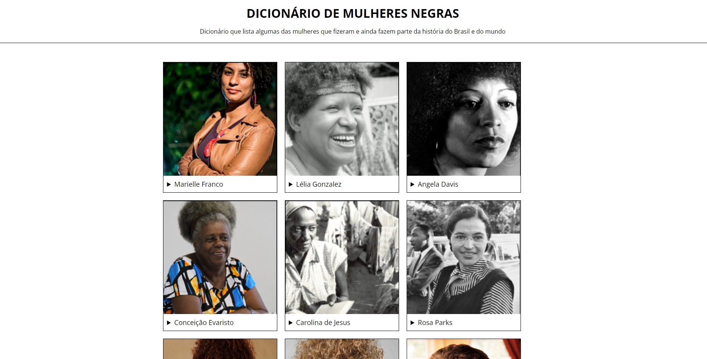

<h1 align="center"> Dicionário de Mulheres Negras </h1>

Projeto desenvolvido na primeira turma do curso de Frontend II da Programaria.

  <a href="#-tecnologias">Tecnologias</a>&nbsp;&nbsp;&nbsp;|&nbsp;&nbsp;&nbsp;
  <a href="#-projeto">Projeto</a>&nbsp;&nbsp;&nbsp;|&nbsp;&nbsp;&nbsp;
  <a href="#-layout">Layout</a>&nbsp;&nbsp;&nbsp;|&nbsp;&nbsp;&nbsp;
  <a href="#memo-licença">Licença</a>

  

 

  

## 🚀 Tecnologias

Esse projeto foi desenvolvido com as seguintes tecnologias:

- HTML e CSS
- JavaScript
- Git e GitHub

## 💻 Projeto

Página com informações sobre algumas das mulheres negras que fizeram e/ou ainda fazem história no Brasil e no mundo.

## 🔖 Layout

Você pode visualizar o layout do projeto no topo desse readme.

## :memo: Licença

Esse projeto está sob a licença MIT.

---

Design by Rafaelly Lemos :wave: - [Acesse o meu LinkedIn](https://www.linkedin.com/in/rafaelly-lemos)
